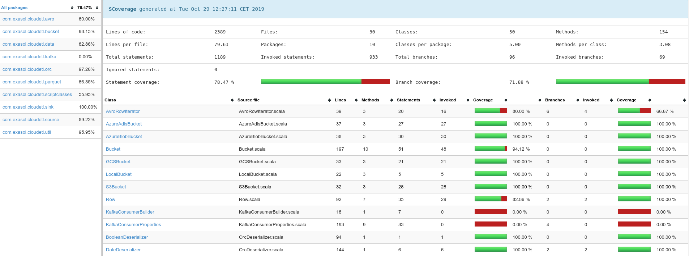

# Developer Guide

This guide provides development workflows that are used to develop and maintain
the kafka-connector-extension. It is intended for those who wish to address the
issues, merge pull request, perform release or deep dive into the codebase of
the project.

## Contributing

Contributions to the kafka-connector-extension project are very welcome!

Please feel free to report a bug, suggest an idea for a feature, or ask a
question about the code.

Please keep in mind that contributions are not only pull requests. They can be
any helpful comment on issues, improving documentation, enhancing build process
and many other tasks.

### Getting in touch

Please feel free to report a bug, suggest an idea for a feature, or ask a
question about the code.

You can create an issue using [Github issues][gh-issues] or follow a standard
[fork and pull][fork-and-pull] process to contribute a code via [Github pull
requests][gh-pulls].

If you do not know where to start, please have a look at [open
issues][open-issues]. You can choose the ones that interest you the most. If you
are new to the project, checkout the issues labeled as
[good-first-issue][first-issue].

### Submitting a pull request

Once you have found an interesting feature or issue to contribute, you can
follow steps below to submit your patches.

- Create a new feature branch, `git checkout -b "cool-new-feature"`
- Code
- Write tests for changes
- Update documentation if needed
- **Make sure everything is working**, run `./scripts/ci.sh`
- If everything is okay, commit and push to your fork
- [Submit a pull request][submit-pr]
- Let us work together to get your changes reviewed
- Merge into master or development branches

If your commit fixes any particular issue, please specify it in your commit
message as `Fixes issue [issue number]`. For example, `Fixes issue #29`.

Some best practices when creating a pull request:

- Rebase or update
- Squash your commits
- Reword your commits
- Write clear commit messages

## Development Environment

You need to have Java version 11 or above installed on your development
machine.

Additionally, we assume you have some experience doing Scala development. If you
have any questions in general or about the development process, please feel free
to [get in touch](#getting-in-touch).

## Building the project

First clone a local copy of the repository:

```bash
git clone https://github.com/exasol/kafka-connector-extension.git
```

Then run `./sbtx`, and run any of these commands:

- `clean`       : cleans previously compiled outputs; to start clean again.
- `compile`     : compiles the source files.
- `test:compile`: compiles the unit test files.
- `it:compile`  : compiles the integration test files.
- `test`        : run all the unit tests.
- `it:test`     : run all the integration tests.
- `doc`         : generate the api documentation.

You can also run several commands combined together:

```
;clean;test;it:test
```

Additionally, you can run `testOnly filename` or `it:testOnly filename` commands
to only run single file tests.

### Running E2E build script

Inside the `scripts/` folder, you will find the `ci.sh` bash file, that runs
end-to-end build process. This file is intended to be run in continuous
integration (CI) environment. For the continuous integration we use the [Travis
CI](https://travis-ci.com/).

Please run this file to make sure that everything is working before commiting
code or submitting a pull request.

```bash
./scripts/ci.sh
```

Additionally, ensure that the `ci.sh` scripts works with different versions of
the Scala programming language. You can check that with the following command:

```bash
TRAVIS_SCALA_VERSION=2.11.12 ./scripts/ci.sh
```

## Checking the test coverage

The `ci.sh` script also creates the code coverage reports. They are located in
the target path, `target/scala-<SCALA.VERSION>/scoverage-report/`.

You can open the `index.html` file, it should show the code coverage reports per
file.



You can also generage the coverage reports using the `sbt` command line, by
running:

```bash
;clean;coverage;test;it:test;coverageReport
```

## Checking the dependency updates

It is important to keep the dependencies up to date.

You can check out if any of dependencies or plugins have new versions, by
running the following commands.

Check if any plugins have new versions:

```bash
pluginUpdates
```

Check if any dependencies have new versions:

```bash
dependencyUpdates
```

### Dependency tree and artifact eviction

You can check the dependency tree by running the comman below:

```bash
dependencyTree
```

Additionally, it is also good practice to check the evicted artifacts, and maybe
to exclude them explicitly when declaring the library dependencies. In order to
check the evicted artifacts, run:

```bash
evicted
```

## Short description on UDF scripts

* The UDF scripts use the [`IMPORT FROM SCRIPT`][import-export-udf] statement.
* The `KAFKA_PATH` is an entry point which internally uses two other scripts
  (`KAFKA_IMPORT` and `KAFKA_METADATA `) to generate an import query. 
* The complete import process runs as a single transaction in the Exasol
  database.

## Editor Setups

We try to keep the codebase code editor agnostic. But we tested that it works
with IntelliJ.

Any setups required for editors is out of scope. However, this can change when
we get contributors who use those code editors :)

## Conclusion

This guide is expected to change and evolve with the changes to the project.
Any pull requests to keep this document updated are very much appreciated!

[gh-issues]: https://github.com/exasol/kafka-connector-extension/issues
[gh-pulls]: https://github.com/exasol/kafka-connector-extension/pulls
[fork-and-pull]: https://help.github.com/articles/using-pull-requests/
[gh-releases]: https://github.com/exasol/kafka-connector-extension/releases
[submit-pr]: https://github.com/exasol/kafka-connector-extension/compare
[open-issues]: https://github.com/exasol/kafka-connector-extension/issues
[first-issue]: https://github.com/exasol/kafka-connector-extension/issues?q=is%3Aissue+is%3Aopen+label%3A%22good+first+issue%22
[import-export-udf]: https://docs.exasol.com/loading_data/user_defined_import_export_using_udfs.htm
